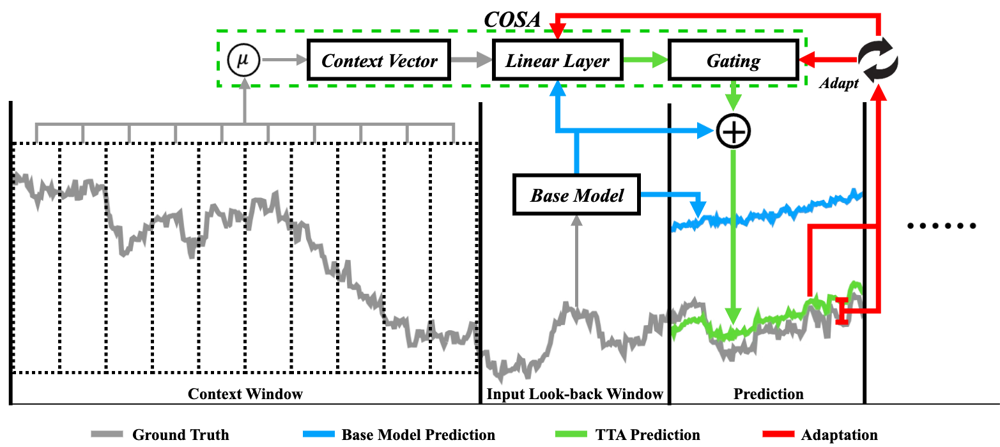
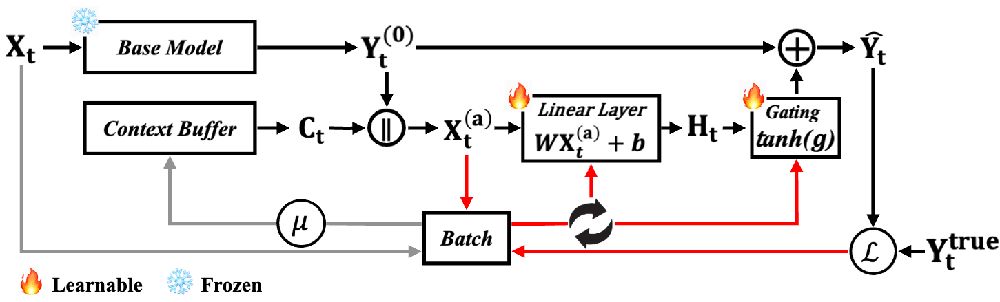

# COSA: Context-aware Output-Space Adapter for Test-Time Adaptation in Time Series Forecasting

[](https://openreview.net/forum?id=L7Z5wBMPrW)
[](https://openreview.net/forum?id=L7Z5wBMPrW)
[](LICENSE)

Official implementation of **COSA** (Context-aware Output-Space Adapter), accepted at **ICLR 2026**.

## Abstract

Test-time adaptation (TTA) enables pre-trained time series forecasting models to adapt to evolving data distributions without accessing the original training data. While recent work introduces separate input and output adapters for online refinement, such dual-adapter designs can overfit to transient patterns and slow down inference. We propose **COSA**, a lightweight **Context-aware Output-Space Adapter** that refines predictions with a single, streamlined module. COSA applies a **linear residual correction** controlled by a **learnable gating mechanism**, incorporating only recently observed ground-truth statistics as context. Extensive experiments on six benchmark datasets across six forecasting architectures show that COSA consistently improves accuracy by **13.91–17.03%** over non-adaptive baselines and **10.48–13.05%** over current state-of-the-art TTA methods, while achieving **88.59–90.10%** faster inference.

## Overview

<p align="center">
  
</p>

## Key Contributions

- **Architecture-agnostic Output Adapter**: A single output-space adapter that works with any base forecasting model without modification
- **Context-aware Linear Residual**: Leverages recent ground-truth statistics to compute adaptive corrections
- **Learnable Gating Mechanism**: Controls the magnitude of corrections via `tanh(g)` gating for stable adaptation
- **Fast & Efficient**: Achieves 88.59–90.10% faster inference compared to dual-adapter TTA methods

## Methodology

<p align="center">
  
</p>

COSA refines the base model prediction Y^(0) through:

```
Ŷ_t = Y^(0)_t + tanh(g) · H_t
```

where:
- **H_t = W · X^(a)_t + b**: Linear transformation of augmented input
- **X^(a)_t = [Y^(0)_t; C_t]**: Concatenation of base prediction and context vector
- **C_t**: Context vector from recent ground-truth statistics
- **tanh(g)**: Learnable gating parameter

### Additional Components

- **PAAS (Periodicity-Aware Adaptive Scheduling)**: Dynamically adjusts batch size based on detected periodicity using FFT
- **CALR (Cosine-Adaptive Learning Rate)**: Adaptive learning rate schedule for stable online adaptation

## Requirements

```bash
pip install -r requirements.txt
```

- Python >= 3.8
- PyTorch >= 1.10
- CUDA (recommended for GPU acceleration)

## Datasets

Download and place datasets in `./datasets/`:

| Dataset | Frequency | Variables | Train/Val/Test |
|---------|-----------|-----------|----------------|
| ETTh1 | Hourly | 7 | 8545/2881/2881 |
| ETTh2 | Hourly | 7 | 8545/2881/2881 |
| ETTm1 | 15-min | 7 | 34465/11521/11521 |
| ETTm2 | 15-min | 7 | 34465/11521/11521 |
| Exchange Rate | Daily | 8 | 5120/665/1422 |
| Weather | 10-min | 21 | 36792/5271/10540 |

## Supported Models

COSA is compatible with various forecasting architectures:

- **iTransformer** 
- **PatchTST** 
- **DLinear** 
- **OLS**
- **FreTS** 
- **MICN** 
## Usage

### Training Base Models

```bash
bash scripts/train.sh
```

### Running COSA (Test-Time Adaptation)

```bash
PAAS=True bash scripts/cosa.sh   # COSA-P
PAAS=False bash scripts/cosa.sh  # COSA-F
```

COSA-P and COSA-F run separately and store their artifacts under
`results/SIMPLE/COSA-P/` and `results/SIMPLE/COSA-F/`, respectively.


### Running Specific Experiments

```bash
python main.py \
  DATA.NAME ETTh1 \
  DATA.PRED_LEN 96 \
  MODEL.NAME iTransformer \
  TRAIN.ENABLE False \
  TRAIN.CHECKPOINT_DIR ./checkpoints/iTransformer/ETTh1_96/ \
  TTA.ENABLE True \
  TTA.SIMPLE.BATCH_SIZE 48 \
  TTA.SIMPLE.STEPS 3 \
  TTA.SIMPLE.BUFFER_CONTEXT_SIZE 10
```

## Results

COSA achieves consistent improvements across all datasets and models:

| Method | vs. Baseline | vs. SOTA TTA | Inference Speed |
|--------|--------------|--------------|-----------------|
| COSA | 13.91–17.03% ↓ | 10.48–13.05% ↓ | 88.59–90.10% ↑ |

*Lower is better for MSE/MAE. Higher is better for speed.*

## Citation

```bibtex
@inproceedings{
im2026cosa,
title={{COSA}: Context-aware Output-Space Adapter for Test-Time Adaptation in Time Series Forecasting},
author={Jeonghwan Im and Hyuk-Yoon Kwon},
booktitle={The Fourteenth International Conference on Learning Representations},
year={2026},
url={https://openreview.net/forum?id=L7Z5wBMPrW}
}
```

## License

This project is licensed under the MIT License. For commercial use, permission is required.

## Acknowledgements

- This implementation references the [Time-Series-Library](https://github.com/thuml/Time-Series-Library)
- Code structure adapted from [TAFAS](https://github.com/kimanki/TAFAS)

Please provide proper attribution if you use our codebase.
